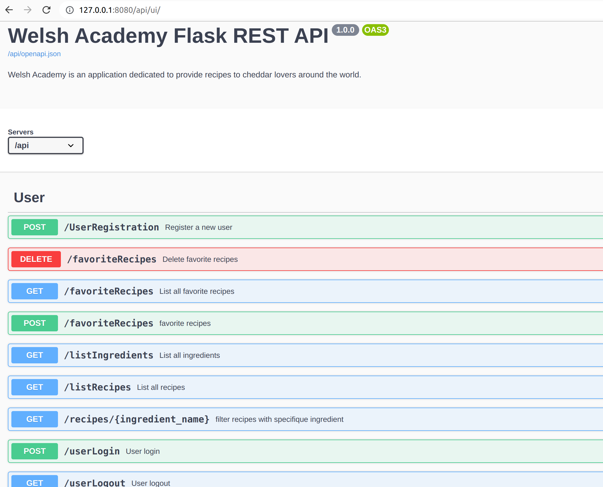

# Welsh Academy
"Welsh Academy" is an application dedicated to provide recipes to cheddar lovers around the world.

Your duty here is to provide a backend in order to allow our cheddar experts to:

    Create ingredients
    Create recipes of meals using the previously created ingredients

For the moment, admins will be the one that create users though the API (don't worry about permission management, the cheese world is a kind world)

A user should be able to enjoy the recipes by using the API to:

    -list all existing ingredients
    -list all possible recipes (with or without ingredient constraints)
    -flag/unflag recipes as his favorite ones
    -list his favorite recipes

## To Setup and Start
''' #build docker image
    sudo docker build -t welshacademy .
    #run the container
    docker run -e WA_PORT=8080 -p 8080:8080 welshacademy
'''
''' #on local
    pip install -r requirements.txt 
    # Initialize the database
    flask db init
    # Perform the database migrations
    flask db migrate
    flask db upgrade
    # run the application
    python manage.py run
'''
    
    
## Create an admin
''' #with Docker
   docker exec -it 8aad1377ce7e python manage.py create_admin
'''
'''
  ~/welshProject$ docker exec -it 8aad1377ce7e python manage.py create_admin
  Enter your name: admin
  Enter password: 
  Admin with name admin created successfully!
'''
''' #create admin locally
    python manage.py create_admin
'''
## API endPoints
### List all ingredients
'''curl -X 'GET' \
   'http://172.17.0.2:8080/api/ingredients' \
   -H 'accept: */*'
'''
### Add a new ingredient
'''
curl -X 'POST' \
  'http://127.0.0.1:8080/api/ingredients' \
  -H 'accept: */*' \
  -H 'Content-Type: application/json' \
  -d '{
  "name": "secret ingredient"
}'
'''
### List Recipes
'''curl -X 'GET' \
  'http://127.0.0.1:8080/api/recipes' \
  -H 'accept: */*'
'''
### Add a new recipe 
'''  curl -X 'POST' \
  'http://127.0.0.1:8080/api/recipes' \
  -H 'accept: */*' \
  -H 'Content-Type: application/json' \
  -d '
  {
  "cookTime": "20min",
  "ingredients": [
    {
      "name": "sugar"
    },
    {
      "name": "secret ingredient"
    }
  ],
  "name": "cake",
  "preparation": "mix all and bake it",
   "serving": 4
   }
  '

'''
## Swagger UI:
Hosted Locally <http://127.0.0.1:5000/api/ui/>
Hosted via Docker <http://172.17.0.2:8080/api/ui/>

## Unit Test with Docker
''' #build docker image for testing
    docker build -t welshacademy-tests -f Dockerfile.test .
    #run tests
    docker run  welshacademy-tests
'''
''' ~/welshProject$ docker run  welshacademy-tests
    test_home_redirect (test_homePage.TestAppRoute) ... ok
    test_create_existing_ingredient (test_ingredients.TestIngredients) ... ok
    test_create_new_ingredient (test_ingredients.TestIngredients) ... ok
    test_read_all_ingredients (test_ingredients.TestIngredients) ... ok
    test_create_existing_recipe (test_recipes.TestRecipes) ... ok
    test_create_new_recipe (test_recipes.TestRecipes) ... ok
    test_create_recipe_ingredient (test_recipes.TestRecipes) ... ok
    test_read_all_recipes (test_recipes.TestRecipes) ... ok
    test_create_user (test_user.TestUserAccount) ... ok
    test_login (test_user.TestUserAccount) ... ok

    ---------------------------------------------------------------------
    Ran 10 tests in 9.740s

    OK
'''

''' # run test on local
    python manage.py tests
'''
## Contact

If you have any questions or comments please email me at belkacem.nourelhouda@hotmail.com.
Thank you for checking out the project. 